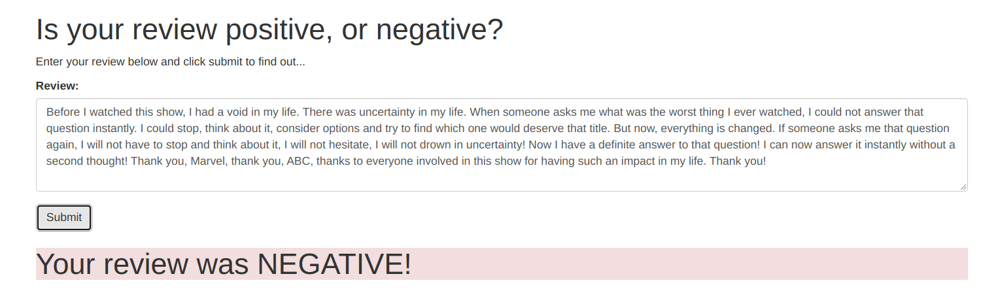
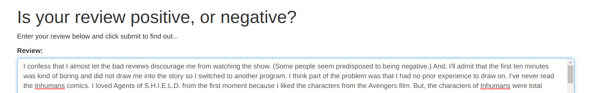

# SageMaker Deployment Project

The notebook and Python files provided here, once completed, result in a simple web app which interacts with a deployed recurrent neural network performing sentiment analysis on movie reviews. This project assumes some familiarity with SageMaker, the mini-project, Sentiment Analysis using XGBoost, should provide enough background.

Please see the [README](https://github.com/udacity/sagemaker-deployment/tree/master/README.md) (see below) in the root directory for instructions on setting up a SageMaker notebook and downloading the project files (as well as the other notebooks).

---
# Deploying a Sentiment Analysis Model using SageMaker

## Project Overview

**Objective:** Using SageMaker to construct an end-to-end project, the purpose of which is to analyze the sentiment of a movie review. 
  Via a simple web page, a user can enter a moview review which will then be sent to a deployed model for inference, determining whether the review is positive or     negative.

